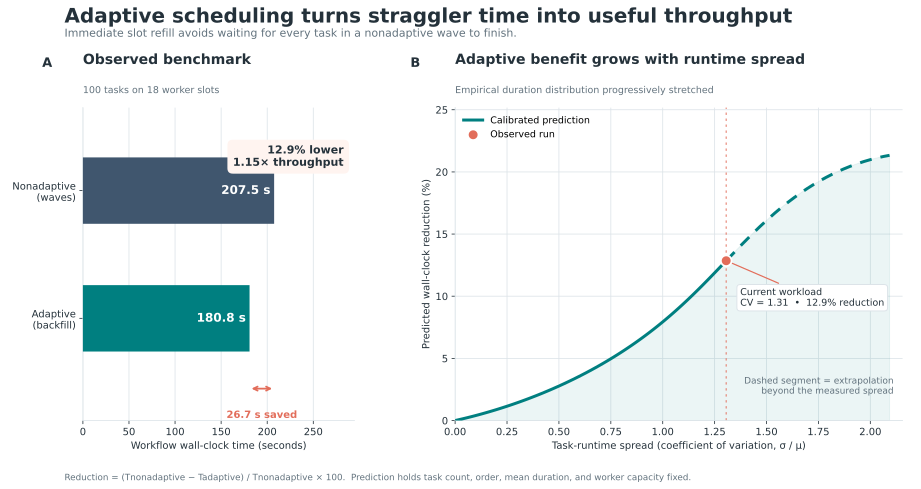

# Adaptive vs. nonadaptive scheduling results



The completed benchmark shows that adaptive scheduling reduced total wall-clock
time from **207.50 seconds to 180.83 seconds**. That is **26.67 seconds saved**, a
**12.85% wall-clock reduction**, or **1.15× the nonadaptive throughput**.

## Prediction model

The figure uses the population coefficient of variation, `CV = standard
deviation / mean`, as the dimensionless measure of task-runtime spread. The
current 100-task workload has `CV = 1.31`.

The curve is a one-point-calibrated discrete scheduling model:

1. Read the task durations and counts from `adaptive.py`.
2. Progressively stretch that empirical distribution by raising every duration
   to an exponent from 0 (equal durations) through 2.5 (a much heavier tail), then
   rescale it to preserve the same mean task duration.
3. Keep the observed task order and 18 worker slots fixed.
4. Model adaptive scheduling as immediate FIFO backfill onto the next available
   slot; model nonadaptive scheduling as fixed waves that wait for their slowest
   task.
5. Calibrate the idealized curve to the measured reduction at the current
   workload. The dashed part is extrapolation beyond the measured spread.

This isolates the mentor's proposed effect: broader task-time distributions
create more within-wave idle time, so immediate adaptive backfill becomes more
valuable. It is a scenario prediction, not a universal guarantee—task ordering,
worker count, dependencies, and scheduler overhead also affect the result. More
repeated benchmarks at several spreads would turn the extrapolated section into
an empirically fitted curve with uncertainty bounds.

## Reproduce the figure

From the repository root, run:

```bash
.venv/bin/python \
  example_workflows/comparisons/adaptive_vs_nonadaptive/plot_adaptive_benefit.py
```

This writes the PNG, SVG, plotted curve data, and summary metrics to `results/`.
